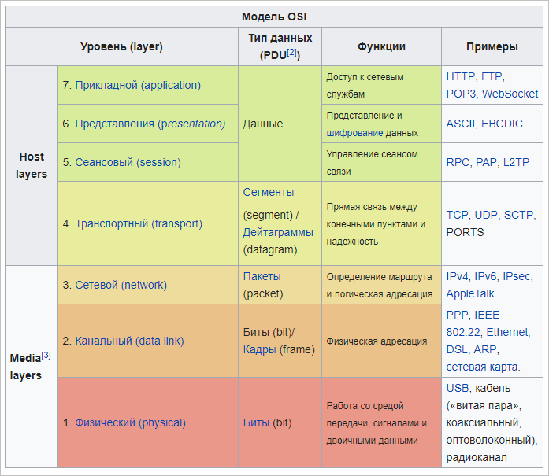
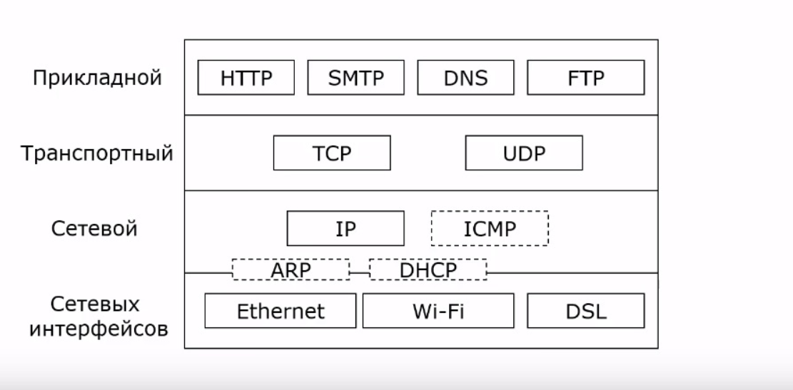
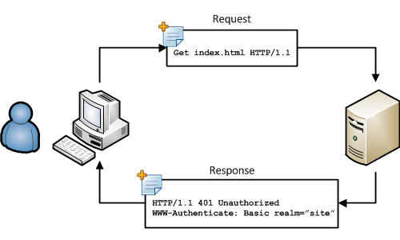
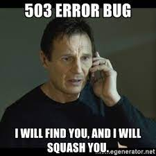
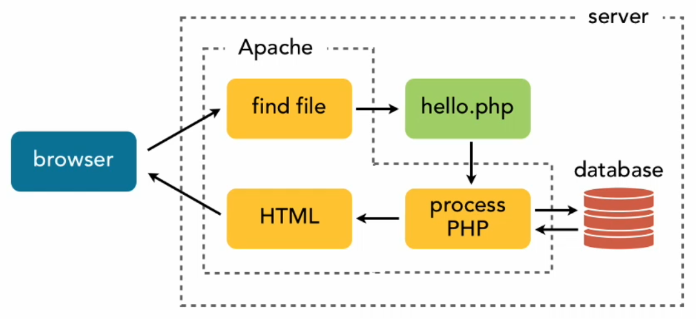
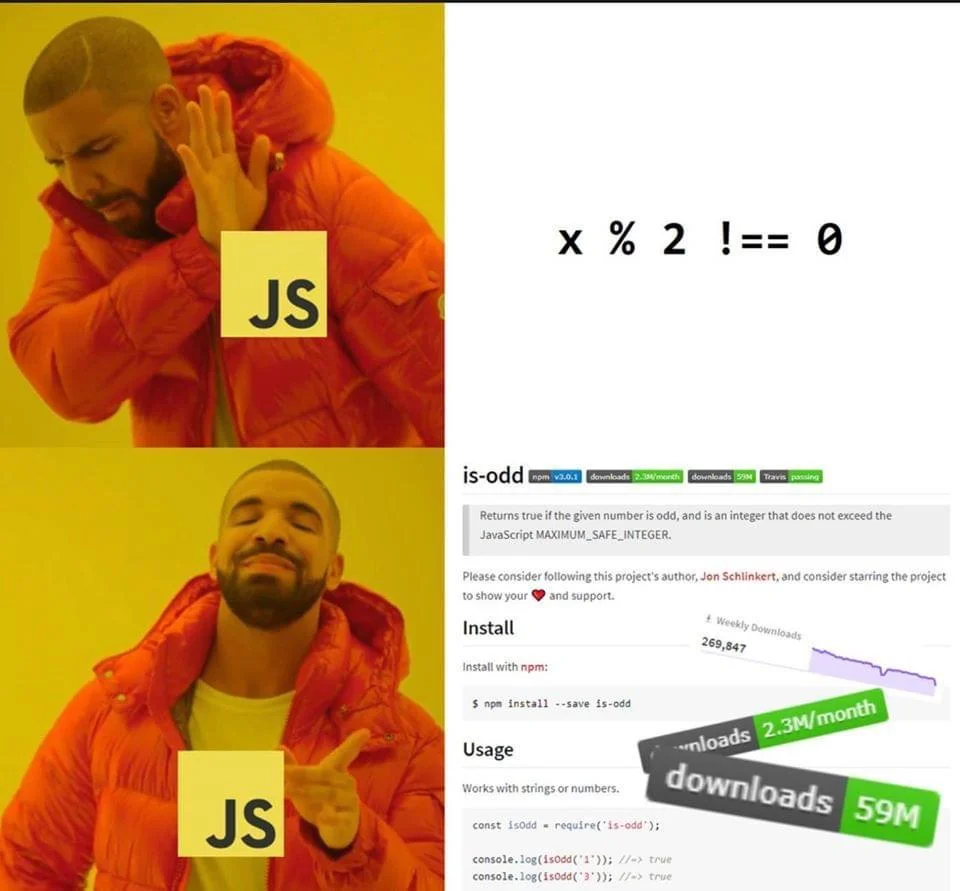
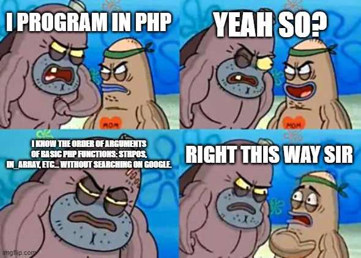

# Знакомство и установка задач. Введение в web

Сетевая модель OSI (The Open Systems Interconnection model) — сетевая модель стека (магазина) сетевых протоколов OSI/ISO. 
Посредством данной модели различные сетевые устройства могут взаимодействовать друг с другом. Модель определяет различные уровни взаимодействия систем. 
Каждый уровень выполняет определённые функции при таком взаимодействии.
Модель OSI была разработана в конце 1970-х годов для поддержания разнообразных методов компьютерных сетей, 
которые в это время конкурировали за применение в крупных национальных сетевых взаимодействиях во Франции, Великобритании и США. 
В 1980-х годах она стала рабочим продуктом группы взаимодействия открытых систем Международной организации по стандартизации (ISO). 
Модель не смогла дать полное описание сети и не получила поддержку архитекторов на заре Интернета, который впоследствии нашел отражение в менее предписывающем TCP/IP, в основном под руководством Инженерного совета Интернета (IETF).



> Я знаю отличную шутку про UDP, но не факт, что она до вас дойдет.

> Я знаю отличную шутку про TCP, но если она до вас не дойдет, то я повторю.

TCP/IP — сетевая модель передачи данных, представленных в цифровом виде. 
Модель описывает способ передачи данных от источника информации к получателю. 
В модели предполагается прохождение информации через четыре уровня, каждый из которых описывается правилом (протоколом передачи). 
Наборы правил, решающих задачу по передаче данных, составляют стек протоколов передачи данных, на которых базируется Интернет. 
Название TCP/IP происходит из двух важнейших протоколов семейства — Transmission Control Protocol (TCP) и Internet Protocol (IP), 
которые были первыми разработаны и описаны в данном стандарте. 
Также изредка упоминается как модель DOD (Department of Defense) в связи с историческим происхождением от сети ARPANET 
из 1970-х годов (под управлением DARPA, Министерства обороны США).



HTTP (англ. HyperText Transfer Protocol — «протокол передачи гипертекста») — протокол прикладного уровня передачи данных, 
изначально — в виде гипертекстовых документов в формате HTML, в настоящее время используется для передачи произвольных данных.



Основой HTTP является технология «клиент-сервер», то есть предполагается существование:

Потребителей (клиентов), которые инициируют соединение и посылают запрос;
Поставщиков (серверов), которые ожидают соединения для получения запроса, производят необходимые действия и возвращают обратно сообщение с результатом.
HTTP в настоящее время повсеместно используется во Всемирной паутине для получения информации с веб-сайтов. В 2006 году в Северной Америке доля HTTP-трафика превысила долю P2P-сетей и составила 46 %, из которых почти половина — это передача потокового видео и звука[1].

HTTP используется также в качестве «транспорта» для других протоколов прикладного уровня, таких как SOAP, XML-RPC, WebDAV.

Основным объектом манипуляции в HTTP является ресурс, на который указывает URI (Uniform Resource Identifier) в запросе клиента. Обычно такими ресурсами являются хранящиеся на сервере файлы, но ими могут быть логические объекты или что-то абстрактное. Особенностью протокола HTTP является возможность указать в запросе и ответе способ представления одного и того же ресурса по различным параметрам: формату, кодировке, языку и т. д. (в частности, для этого используется HTTP-заголовок). Именно благодаря возможности указания способа кодирования сообщения клиент и сервер могут обмениваться двоичными данными, хотя данный протокол является текстовым.

HTTP — протокол прикладного уровня; аналогичными ему являются FTP и SMTP. Обмен сообщениями идёт по обыкновенной схеме «запрос-ответ». Для идентификации ресурсов HTTP использует глобальные URI. В отличие от многих других протоколов, HTTP не сохраняет своего состояния. Это означает отсутствие сохранения промежуточного состояния между парами «запрос-ответ». Компоненты, использующие HTTP, могут самостоятельно осуществлять сохранение информации о состоянии, связанной с последними запросами и ответами (например, «куки» на стороне клиента, «сессии» на стороне сервера). Браузер, посылающий запросы, может отслеживать задержки ответов. Сервер может хранить IP-адреса и заголовки запросов последних клиентов. Однако сам протокол не осведомлён о предыдущих запросах и ответах, в нём не предусмотрена внутренняя поддержка состояния, к нему не предъявляются такие требования.

Большинство протоколов предусматривает установление TCP-сессии, в ходе которой один раз происходит авторизация, и дальнейшие действия выполняются в контексте этой авторизации. HTTP же устанавливает отдельную TCP-сессию на каждый запрос; в более поздних версиях HTTP было разрешено делать несколько запросов в ходе одной TCP-сессии, но браузеры обычно запрашивают только страницу и включённые в неё объекты (картинки, каскадные стили и т. п.), а затем сразу разрывают TCP-сессию. Для поддержки авторизованного (неанонимного) доступа в HTTP используются cookies; причём такой способ авторизации позволяет сохранить сессию даже после перезагрузки клиента и сервера.

При доступе к данным по FTP или по файловым протоколам тип файла (точнее, тип содержащихся в нём данных) определяется по расширению имени файла, что не всегда удобно. HTTP перед тем, как передать сами данные, передаёт заголовок «Content-Type: тип/подтип», позволяющий клиенту однозначно определить, каким образом обрабатывать присланные данные. Это особенно важно при работе с CGI-скриптами, когда расширение имени файла указывает не на тип присылаемых клиенту данных, а на необходимость запуска данного файла на сервере и отправки клиенту результатов работы программы, записанной в этом файле (при этом один и тот же файл в зависимости от аргументов запроса и своих собственных соображений может порождать ответы разных типов — в простейшем случае картинки в разных форматах).

Кроме того, HTTP позволяет клиенту прислать на сервер параметры, которые будут переданы запускаемому CGI-скрипту. Для этого же в HTML были введены формы.

Перечисленные особенности HTTP позволили создавать поисковые машины (первой из которых стала AltaVista, созданная фирмой DEC), форумы и Internet-магазины. Это коммерциализировало Интернет, появились компании, основным полем деятельности которых стало предоставление доступа в Интернет (провайдеры) и создание сайтов.

#### Коды ответа HTTP

1. Информационные 100 - 199
2. Успешные 200 - 299
3. Перенаправления 300 - 399
4. Клиентские ошибки 400 - 499
5. Серверные ошибки 500 - 599

[Следующая таблица содержит список всех кодов и их значения](https://developer.mozilla.org/ru/docs/Web/HTTP/Status)




### Диаграмма работы php в связке с вебсервером




### Язык разметки HTML


HTML (от англ. HyperText Markup Language — «язык гипертекстовой разметки») — стандартизированный язык разметки документов для просмотра веб-страниц в браузере. 
Веб-браузеры получают HTML документ от сервера по протоколам HTTP/HTTPS или открывают с локального диска, далее интерпретируют код в интерфейс, который будет отображаться на экране монитора.

Элементы HTML являются строительными блоками HTML страниц. 
С помощью HTML разные конструкции, изображения и другие объекты такие как интерактивная веб-формы могут быть встроены в отображаемую страницу. 
HTML предоставляет средства для создания заголовков, абзацев, списков, ссылок, цитат и других элементов. Элементы HTML выделяются тегами, записанными с использованием угловых скобок. 
Такие теги, как  и <input />, напрямую вводят контент на страницу. Другие теги, такие как <p>, окружают и оформляют текст внутри себя и могут включать другие теги в качестве подэлементов. 
Браузеры не отображают HTML-теги, но используют их для интерпретации содержимого страницы.

Язык XHTML является более строгим вариантом HTML, он следует синтаксису XML и является приложением языка XML в области разметки гипертекста.

В HTML можно встроить программый код на языке программирования JavaScript, для управления поведением и содержанием веб-страниц. Также включение CSS в HTML описывает внешний вид и макет страницы.

```html 
<!DOCTYPE html>
<html>
<body>

<h1>My First Heading</h1>

<p>My first paragraph.</p>

</body>
</html>
```

### CSS

CSS (Cascading Style Sheets) — это код, который вы используете для стилизации вашей веб-страницы. Основы CSS помогут вам понять, что вам нужно для начала работы. 
Мы ответим на такие вопросы как: Как сделать мой текст черным или красным? Как сделать так, чтобы контент появлялся в определённом месте на экране? 
Как украсить мою веб-страницу с помощью фоновых изображений и цветов?

Так что же такое CSS?
Как и HTML, CSS на самом деле не является языком программирования. 
Это не язык разметки - это язык таблицы стилей. Это означает, что он позволяет применять стили выборочно к элементам в документах HTML. 
Например, чтобы выбрать все элементы абзаца на HTML странице и изменить текст внутри них с чёрного на красный, вы должны написать этот CSS:

```css 
p {
  color: red;
}
```

### Javascript



JavaScript® (часто сокращают до JS) — это лёгкий, интерпретируемый, объектно-ориентированный язык с функциями первого класса, самый известный скриптовый язык для веб-страниц, но также используется во многих не браузерных окружениях. Прототипно-ориентированный, мультипарадигменный язык сценариев, который поддерживает динамический, объектно-ориентированный, императивный и функциональный стили программирования.

JavaScript запускается на стороне клиента Интернета, который может использоваться для создания/программирования того, как веб-страницы будут вести себя при наступлении каких-либо событий. JavaScript легко изучить, а также это мощный скриптовый язык, широко используемый для контролирования поведения веб-страниц.

Вопреки распространённому мнению, JavaScript не является "интерпретируемым Java". В двух словах, JavaScript — это динамический скриптовый язык, поддерживающий прототипное создание объектов. Базовый синтаксис намеренно похож на Java и C++, чтобы уменьшить число новых концепций, необходимых для изучения языка. Такие языковые конструкции, как if, for, while, switch, try ... catch похожи на конструкции этих языков.

JavaScript может функционировать и как процедурный, и как объектно-ориентированный язык. Объекты можно создавать программно во время выполнения, путём присоединения методов и свойств или пустых объектов во время выполнения, в отличие от синтаксических определений классов в компилируемых языках, таких как С++ или Java. После того, как объект был создан, он может быть использован в качестве плана (или прототипа) для создания похожих объектов.

Динамические возможности JavaScript включают: создание объектов во время выполнения, переменное число параметров, динамическое создание скриптов (с помощью eval), перебор объектов (с помощью for ... in), восстановление исходного кода (программы на JavaScript могут декомпилировать тела функций обратно в исходный код).

```js 
// How to create variables:
var x;
let y;

// How to use variables:
x = 5;
y = 6;
let z = x + y;
```

#### PHP

PHP (/pi:.eɪtʃ.pi:/ англ. PHP: Hypertext Preprocessor — «PHP: препроцессор гипертекста»; первоначально PHP/FI (Personal Home Page / Form Interpreter), а позже названный Personal Home Page Tools— «Инструменты для создания персональных веб-страниц») — 
скриптовый язык общего назначения, интенсивно применяемый для разработки веб-приложений. В настоящее время поддерживается подавляющим большинством хостинг-провайдеров и является одним из лидеров среди языков, применяющихся для создания динамических веб-сайтов.
Язык и его интерпретатор (Zend Engine) разрабатываются группой энтузиастов в рамках проекта с открытым кодом. Проект распространяется под собственной лицензией, несовместимой с GNU GPL.

В области веб-программирования, в частности серверной части, PHP — один из популярных сценарных языков (наряду с JSP, Perl и языками, используемыми в ASP.NET).

Популярность в области построения веб-сайтов определяется наличием большого набора встроенных средств и дополнительных модулей для разработки веб-приложений. Основные из них:

автоматическое извлечение POST- и GET-параметров, а также переменных окружения веб-сервера в предопределённые массивы;
взаимодействие с большим количеством различных систем управления базами данных через дополнительные модули (MySQL, MySQLi, SQLite, PostgreSQL, Oracle Database (OCI8), Microsoft SQL Server, Sybase, ODBC, mSQL, IBM DB2, Cloudscape и Apache Derby, Informix, Ovrimos SQL, Lotus Notes, DB++, DBM, dBase, DBX, FrontBase, FilePro, Ingres II, SESAM, Firebird и InterBase, Paradox File Access, MaxDB, интерфейс PDO, Redis);
автоматизированная отправка HTTP-заголовков;
работа с HTTP-авторизацией;
работа с cookies и сессиями;
работа с локальными и удалёнными файлами, сокетами;
обработка файлов, загружаемых на сервер;
работа с XForms.
По состоянию на 2010-е годы используется сотнями тысяч разработчиков; согласно рейтингу корпорации TIOBE, базирующемуся на данных поисковых систем, в мае 2016 года PHP находился на 6 месте среди языков программирования.

Входит в LAMP — распространённый набор программного обеспечения для создания и хостинга веб-сайтов (Linux, Apache, MySQL, PHP).

Среди сайтов, использующих PHP — Facebook, Wikipedia, Yahoo!, Baidu.



## Полезные Ссылки

[LAMP](https://ru.wikipedia.org/wiki/LAMP)
[How to Install LAMP stack on Ubuntu](https://betterprogramming.pub/how-to-install-lamp-stack-on-ubuntu-db77ac018116)
[Простое пособие по сетевой модели OSI для начинающих](https://selectel.ru/blog/osi-for-beginners/)
[Руководство по стеку протоколов TCP/IP для начинающих](https://selectel.ru/blog/tcp-ip-for-beginners/)
[Простым языком об HTTP](https://habr.com/ru/post/215117/)
[JavaScript Учебные материалы](https://developer.mozilla.org/ru/docs/Web/JavaScript)
[Введение в HTML](https://developer.mozilla.org/ru/docs/Learn/HTML/Introduction_to_HTML)
[Основы CSS](https://developer.mozilla.org/ru/docs/Learn/Getting_started_with_the_web/CSS_basics)